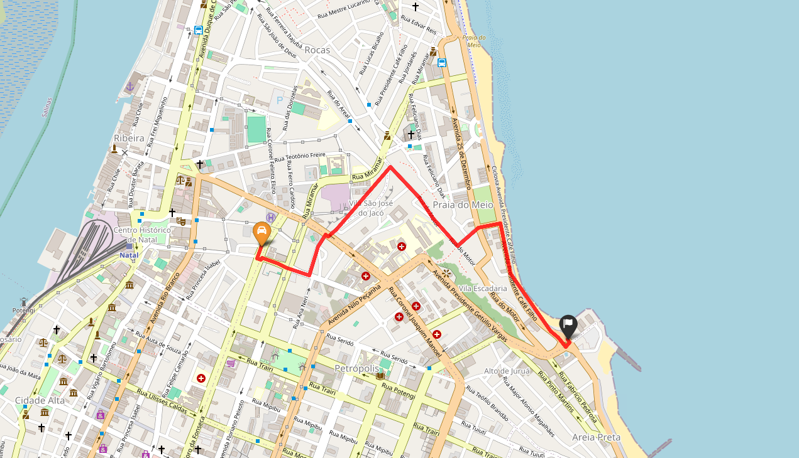

## RideSmart — Modelagem e Análise de Rotas Urbanas com Grafos


## Descrição do Projeto
O **RideSmart** é o projeto final da disciplina de **Estrutura de Dados II (ED2)**. O sistema simula o motor de roteamento de um aplicativo de mobilidade urbana multimodal aplicado à cidade de **Natal/RN**. 

O objetivo principal é resolver o seguinte problema de otimização viária:
> Dado um ponto de origem `A`, um destino `B` e uma distância máxima `X` que o usuário aceita caminhar, o algoritmo realiza uma varredura espacial para determinar o **Ponto de Embarque Ideal `P`** que minimiza o tempo global da viagem (Caminhada + Trajeto de Carro enfrentando trânsito).

```text
 Trecho 1: A ➔ P (Caminhada via G_pedestre)
 Trecho 2: P ➔ B (Carro com trânsito via G_carro)

```

##  Arquitetura e Modelagem do Grafo

Para evitar anomalias de roteamento e contaminação de regras viárias, a cidade de Natal foi modelada em **Duas Camadas de Grafos Independentes**:

1. **Rede de Carros (`G_carro`):** Focada estritamente em ruas transitáveis por veículos automotores. Respeita as restrições de sentido proibido (`oneway: True`) e possui custos ponderados por **trânsito sintético** (atrasos de pico variando de $1.5\times$ a $3.0\times$ em grandes artérias como a Via Costeira).
2. **Rede de Pedestres (`G_pedestre`):** Focada em calçadas, praças e passarelas. As restrições de mão única são ignoradas (`oneway: False`) e o custo é baseado puramente na distância física linear (`length`), considerando uma velocidade de caminhada humana constante de $1.2\text{ m/s}$.

---

##  Algoritmos Implementados e Comparados

O projeto avalia o desempenho empírico e a corretude de **5 algoritmos de caminhos mínimos**:

* **Dijkstra Simples:** Busca linear por menor custo com complexidade $O(V^2)$.
* **Dijkstra com Heap:** Otimizado com fila de prioridades binária, com complexidade $O(E \log V)$.
* **Dijkstra Bidirecional:** Algoritmo adicional da literatura que expande frentes de onda simultâneas da origem e do destino.
* **Algoritmo A-Estrela:** Busca heurística direcionada utilizando a **Fórmula de Haversine** adaptada para tempo como função de custo estimado.
* **Bellman-Ford:** Contraexemplo acadêmico utilizado para avaliar o impacto do relaxamento exaustivo de arestas $O(V \cdot E)$.

---

---

##  Resultados e Análise Comparativa

###  Cenário de Teste Configurado (Oficial)
Para a validação final e auditoria das estruturas de dados, configuramos um cenário de teste real interbairros na região central de Natal/RN (Conexão Alecrim ➔ Tirol):

* **Origem (Nó A - Pedestre):** `301429461` (Coordenadas: -5.78037, -35.20187)
* **Destino (Nó B - Carro):** `6991059126` (Coordenadas: -5.78348, -35.19113)
* **Raio Máximo de Caminhada ($X$):** $500\text{ metros}$ na malha de pedestres (**156 pontos elegíveis avaliados**).
* **Ponto de Embarque Otimizado (P):** `301429461` (Origem Direta).

### Tabela de Desempenho (Padrão IEEE)

| Algoritmo (ED2) | Origem (Nó A) | Destino (Nó B) | Decisão Decidida | Ponto P Ideal | Tempo Global (min) | Nós Rota Carro | Runtime (ms) |
| :--- | :---: | :---: | :--- | :---: | :---: | :---: | :---: |
| **Dijkstra Simples O(V²)** | 301429461 | 6991059126 | Embarque Direto em A | 301429461 | 4.07 | 37 | 27.734,649 |
| **Dijkstra + Heap O(E log V)** | 301429461 | 6991059126 | Embarque Direto em A | 301429461 | 4.07 | 37 | 1.625,772 |
| **Dijkstra Bidirecional** | 301429461 | 6991059126 | Embarque Direto em A | 301429461 | 4.07 | 37 | 2.613,473 |
| **Algoritmo A\* (Haversine)** | 301429461 | 6991059126 | Embarque Direto em A | 301429461 | 4.07 | 37 | **1.597,430** |
| **Bellman-Ford O(V·E)** | 301429461 | 6991059126 | Embarque Direto em A | 301429461 | 4.07 | 37 | 1.127.934,987 |

###  Discussão Crítica dos Novos Resultados
* **Inteligência do Trade-off (Caminhada vs. Tempo):** O sistema provou sua robustez ao decidir pelo *Embarque Direto*. Como a rota de carro leva apenas 4 minutos, qualquer deslocamento a pé consumiria mais tempo do que a economia gerada, provando que o algoritmo calcula o balanço real de custo-benefício.
* **Explosão Combinatória no Bellman-Ford:** Como o algoritmo precisou varrer as 48.203 arestas de Natal multiplicadas pelos 156 pontos do raio de busca, ele levou incríveis **1.127 segundos (mais de 18 minutos!)** para computar uma rota simples de 4 minutos. Isso sacramenta sua inviabilidade prática em sistemas de transporte de grande escala.
* **Supremacia do A\*:** O $A^*$ com a heurística de Haversine cravou o menor tempo de processamento (**1.597 ms**), demonstrando excelente eficiência ao podar ramos desnecessários do grafo de Natal na direção leste do destino.

---

##  Visualização Multimodal no Mapa

O sistema utiliza a biblioteca `Folium` para renderizar o mapa interativo das rotas calculadas. A rota multimodal exibe o trecho a pé (**linha azul**) até o ponto de embarque otimizado, seguido pelo trajeto vehicular (**linha vermelha**) desviando dos gargalos de trânsito em Natal.




---

##  Como Executar o Projeto

1. Clone o repositório:

```bash
git clone [https://github.com/seu-usuario/Projeto_Final_ED2_RideSmart.git](https://github.com/seu-usuario/Projeto_Final_ED2_RideSmart.git)

```

2. Instale as dependências exigidas:

```bash
pip install osmnx networkx folium pandas matplotlib

```

3. Abra e execute o arquivo principal:

```bash
jupyter notebook PROJETO_FINAL.ipynb

```

---

## Componentes do Grupo

* **Werber Arles de Souza Barradas** - 20250070655
* **Nilton Fontes Barreto Neto** - 20250070771

---

**Junho de 2026** - Universidade Federal do Rio Grande do Norte (UFRN)

``

```
