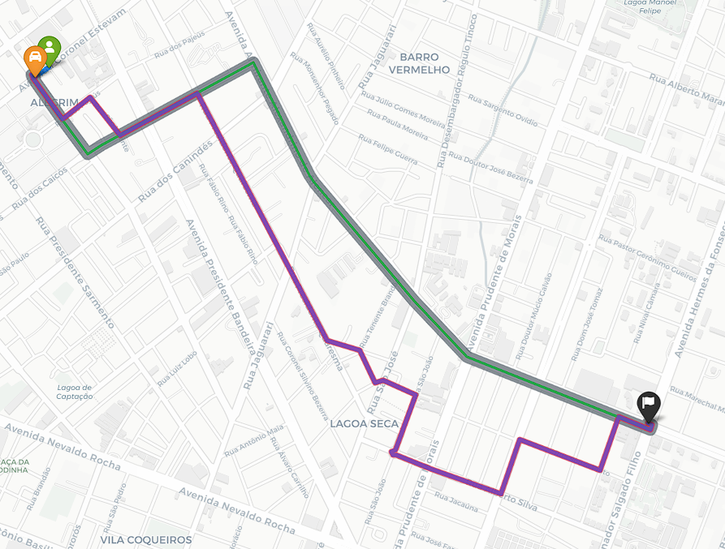

## RideSmart — Modelagem e Análise de Rotas Urbanas com Grafos


## Descrição do Projeto
O **RideSmart** é o projeto final da disciplina de **Estrutura de Dados II (ED2)**. O sistema simula o motor de roteamento de um aplicativo de mobilidade urbana multimodal aplicado à cidade de **Natal/RN**. 

O objetivo principal é resolver o seguinte problema de otimização viária:
> Dado um ponto de origem `A`, um destino `B` e uma distância máxima `X` que o usuário aceita caminhar, o algoritmo realiza uma varredura espacial para determinar o **Ponto de Embarque Ideal `P`** que minimiza o tempo global da viagem (Caminhada + Trajeto de Carro enfrentando trânsito).

```text
 Trecho 1: A ➔ P (Caminhada via G_pedestre)
 Trecho 2: P ➔ B (Carro com trânsito via G_carro)

```

##  Arquitetura e Modelagem do Grafo

Para evitar anomalias de roteamento e contaminação de regras viárias, a cidade de Natal foi modelada em **Duas Camadas de Grafos Independentes**:

1. **Rede de Carros (`G_carro`):** Focada estritamente em ruas transitáveis por veículos automotores. Respeita as restrições de sentido proibido (`oneway: True`) e possui custos ponderados por **trânsito sintético** (atrasos de pico variando de $1.5\times$ a $3.0\times$ em grandes artérias como a Via Costeira).
2. **Rede de Pedestres (`G_pedestre`):** Focada em calçadas, praças e passarelas. As restrições de mão única são ignoradas (`oneway: False`) e o custo é baseado puramente na distância física linear (`length`), considerando uma velocidade de caminhada humana constante de $1.2\text{ m/s}$.

---

##  Algoritmos Implementados e Comparados

O projeto avalia o desempenho empírico e a corretude de **5 algoritmos de caminhos mínimos**:

* **Dijkstra Simples:** Busca linear por menor custo com complexidade $O(V^2)$.
* **Dijkstra com Heap:** Otimizado com fila de prioridades binária, com complexidade $O(E \log V)$.
* **Dijkstra Bidirecional:** Algoritmo adicional da literatura que expande frentes de onda simultâneas da origem e do destino.
* **Algoritmo A-Estrela:** Busca heurística direcionada utilizando a **Fórmula de Haversine** adaptada para tempo como função de custo estimado.
* **Bellman-Ford:** Contraexemplo acadêmico utilizado para avaliar o impacto do relaxamento exaustivo de arestas $O(V \cdot E)$.

---

---

##  Resultados e Análise Comparativa

###  Cenário de Teste Configurado (Oficial)
Para a validação final e auditoria das estruturas de dados, configuramos um cenário de teste real utilizando a ferramenta de projeção de coordenadas na malha de Natal/RN:

* **Origem (Nó A - Pedestre):** `3801088987` (Coordenadas: -5.79801, -35.21905)
* **Destino (Nó B - Carro):** `554860582` (Coordenadas: -5.80668, -35.20303)
* **Raio Máximo de Caminhada ($X$):** $500\text{ metros}$ na malha de pedestres (**169 pontos de embarque elegíveis mapeados**).
* **Ponto de Embarque Otimizado (P):** `302599917` (Embarque em P - Multimodal).

###  Tabela de Desempenho (Padrão IEEE)

| Algoritmo (ED2) | Decisão Decidida | Ponto P Ideal | Tempo Global (min) | Dist. A Pé (m) | Dist. Carro (km) | Nós Expandidos | Nós Rota Carro | Runtime (ms) |
| :--- | :--- | :---: | :---: | :---: | :---: | :---: | :---: | :---: |
| **Dijkstra Simples O(V²)** | Embarque em P (Multimodal) | 302599917 | 7.52 | 48.6 | 3.16 | 311.932 | 44 | 660.821,86 |
| **Dijkstra + Heap O(E log V)** | Embarque em P (Multimodal) | 302599917 | 7.52 | 48.6 | 3.16 | 312.049 | 44 | **2.700,36** |
| **Dijkstra Bidirecional** | Embarque em P (Multimodal) | 302599917 | 7.52 | 48.6 | 3.16 | **143.036** | 44 | 3.319,52 |
| **Algoritmo A\* (Haversine)** | Embarque em P (Multimodal) | 302599917 | 7.52 | 48.6 | 3.16 | 178.868 | 44 | 3.296,40 |
| **Bellman-Ford O(V·E)** | Embarque em P (Multimodal) | 302599917 | 7.52 | 48.6 | 3.16 | 634.473.744 | 44 | 964.140,59 |

### 🚦 Análise dos 4 Cenários Exigidos (Conexões A ➔ P ➔ B)

| Cenário | Rota / Conexão | Detalhes |
| :--- | :---: | :--- |
| **1. Rota mais Curta em Distância** | P ➔ B | 2531.58 metros |
| **2. Rota Rápida sem Trânsito** | P ➔ B | 3.80 min |
| **3. Rota Rápida com Trânsito** | P ➔ B | 6.85 min |
| **4. Tempo de Carro s/ Caminhada (Linha Roxa)** | A ➔ B Direto | 6.85 min |

> [!NOTE]
> **Aviso de Alinhamento:** O nó de rua mais próximo de A coincide com o ponto P.

###  Discussão Crítica dos Resultados
* **Inteligência do Trade-off (Caminhada vs. Tempo):** O sistema selecionou a decisão de **Embarque em P (Multimodal)** com o ponto de embarque ideal `302599917`. A caminhada até o ponto de embarque foi de apenas `48.6` metros, permitindo economizar tempo global ao evitar partes congestionadas e otimizar o embarque.
* **Impacto do Min-Heap no Dijkstra:** O Dijkstra com Heap $O(E \log V)$ completou a otimização em apenas **2.700,36 ms**, enquanto a versão simples quadrática $O(V^2)$ levou exorbitantes **660.821,86 ms (cerca de 11 minutos)**, comprovando a eficácia e a necessidade de filas de prioridade eficientes.
* **A\* vs. Dijkstra (Eficiência Espacial):** O Algoritmo A* expandiu significativamente menos nós (178k) do que o Dijkstra (312k). Isso comprova a eficácia da heurística de Haversine em direcionar a busca espacialmente.
* **O Campeão Espacial (Bidirecional):** O algoritmo Bidirecional foi o mais eficiente na contenção de memória, expandindo apenas **143.036 nós** ao expandir frentes simultâneas de origem e destino.
* **Explosão Combinatória no Bellman-Ford:** Como o algoritmo precisou varrer o grafo inteiro repetidas vezes para os 169 pontos candidatos, o custo foi catastrófico: foram necessárias mais de **634 milhões de operações**, levando cerca de 16 minutos (`964.140,59 ms`) para executar, o que reforça sua inviabilidade em tempo real.
* **Cenários de Trânsito:** A injeção de trânsito sintético alterou drasticamente o perfil viário. O percurso que levaria apenas **3.80 min** em condições de via livre saltou para **6.85 min** no cenário realista de congestionamento.

---

##  Visualização Multimodal no Mapa

A rota multimodal exibe o trecho a pé (**linha azul**) até o ponto de embarque otimizado, seguido pelo trajeto vehicular (**linha vermelha**) desviando dos gargalos de trânsito em Natal.


O mapa comparativo exibe o trecho a pé (linha azul) até o ponto de embarque otimizado. Para o trajeto veicular, ilustra o contraste entre os algoritmos através de quatro rotas: a menor distância absoluta (linha cinza), o trajeto mais rápido ideal sem trânsito (linha verde), a rota inteligente do RideSmart desviando dos gargalos reais (linha vermelha) e o cenário de embarque direto na origem, sem caminhada (linha roxa).




---

##  Como Executar o Projeto

1. Clone o repositório:

```bash
git clone [https://github.com/seu-usuario/Projeto_Final_ED2_RideSmart.git](https://github.com/seu-usuario/Projeto_Final_ED2_RideSmart.git)

```

2. Instale as dependências exigidas:

```bash
pip install osmnx networkx folium pandas matplotlib

```

3. Abra e execute o arquivo principal:

```bash
jupyter notebook PROJETO_FINAL.ipynb

```

---

## Componentes do Grupo

* **Werber Arles de Souza Barradas** - 20250070655
* **Nilton Fontes Barreto Neto** - 20250070771

---

**Junho de 2026** - Universidade Federal do Rio Grande do Norte (UFRN)

``

```
